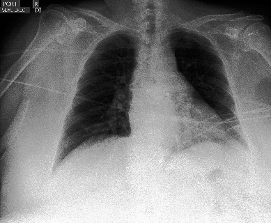

# Ensemble-Distribution-Distilation
This repo contains some code files used for my Masters Thesis “Uncertainty Estimation in Medical Imaging” {Dissertation.pdf}. The Dataset is a multi-class image dataset of chest X-rays. The main contribution of this project was extending the application of Ensemble Distribution Distillation to a multiclass classification problem where numerous positive labels are possible for an individual exemplar.

This is done by training a single CNN to parameterise a mixture of Beta Distributions, which requires the derivation of a custom loss function. The purpose of this is to preserve both the superior accuracy and uncertainty estimation provided by ensembling multiple CNN's while reducing the computational requirements by only using one model for inference.

## Dataset
CheXpert Dataset : https://stanfordmlgroup.github.io/competitions/chexpert/

## Code
This repo contains the code files to:
1) Train an ensemble of CNNs with weights randomly initialised
2) Train an ensemble of CNNs with weights initialised from MNIST task
3) Distill an ensemble into an a single model using Ensemble Distribution Distillation

